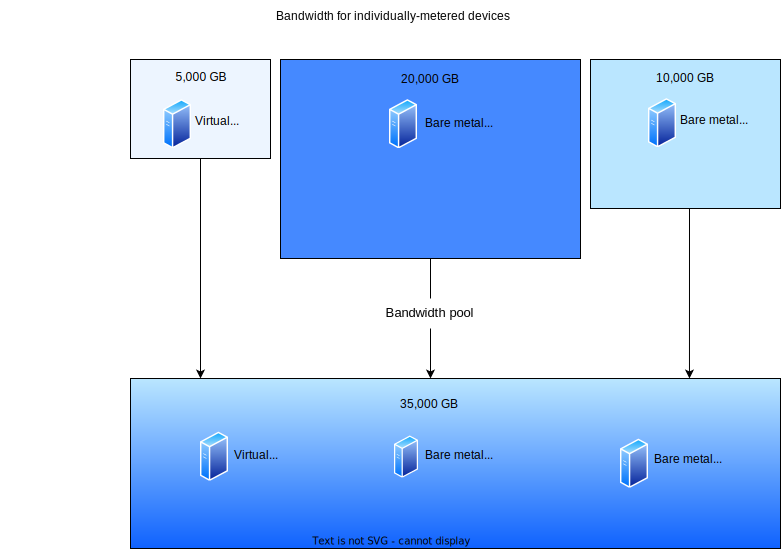

---

copyright:
  years: 2022
lastupdated: "2022-12-07"

keywords: bandwidth services, bandwidth pools, classic bandwidth

subcollection: bandwidth-services

---

{{site.data.keyword.attribute-definition-list}}

# Getting started with bandwidth services
{: #get-started-with-bandwidth-services}

Use bandwidth services to manage your device's bandwidth and bandwidth pools. Learn how to choose the best value bandwidth solution, how to respond to overage notices, and how to create and manage bandwidth pools and other bandwidth services for your devices. 
{: shortdesc}

## Understanding bandwidth metering versus bandwidth pools
{: #bw-services-understanding-differences}

To use your allocated bandwidth more efficiently, it's important to understand how bandwidth in the Classic IaaS platform works and understand the bandwidth management options. 

You can purchase and manage bandwidth for classic services in two ways. You can manage bandwidth on a single device by purchasing a fixed amount of bandwidth allocation for that device during a billing cycle. You receive a notification when the device uses 85% of its allocated bandwidth for the billing cycle.

Additionally, you can add a device's bandwidth allocation to a bandwidth pool. A bandwidth pool aggregates each added device's individual bandwidth allocation into a collective bandwidth allocation. As devices in the pool use bandwidth during the month, the usage is metered for the bandwidth pool and measured against the collective bandwidth allocation limit. Notifications are sent to users when the devices in the pool collectively use 85% of the pool's allocated bandwidth. 

Figure 1 illustrates how adding servers with individual bandwidth allocations to a bandwidth pool increases the bandwidth pool's collective bandwidth allocation. In this case, three servers are added to a bandwidth pool: Virtual server instance 1 with 5,000 GB of bandwidth, Bare metal server 1 with 20,000 GB of bandwidth, and Bare metal server 2 with 10,000 GB of bandwidth. Therefore, the bandwidth pool's collective bandwidth allocation is 35,000 GB, the sum of each server's allocated bandwidth in the pool. 

Bandwidth pool highlights include: 

- defined geographically (charges vary depending on the region of your pool)
- allocated a bandwidth amount that's the sum of allocations for devices in the pool
- billed a pool overage fee when bandwidth usage exceeds bandwidth allocation
- billed a membership fee per device in the pool

100 percent of the bandwidth from each server added to a bandwidth pool is added to the pool's collective bandwidth allocation. 
{: important}

{: caption="Figure 1. Adding servers with individual bandwidth allocations to a bandwidth pool" caption-side="bottom"}

Bandwidth pools are beneficial when you have devices with variable month-to-month usage. In months during which the device uses little bandwidth, adding a device's individual bandwidth allocation to a bandwidth pool can allow other devices in the pool to use the remaining bandwidth. This action can prevent that device's pre-purchased bandwidth allocation from being under-utilized. A similar benefit can occur in months during which the device risks exceeding its allocation. Including the device in the bandwidth pool with devices that have unused bandwidth can prevent the device with heavy use from incurring an overage. 

## Managing bandwidth services 
{: #managing-bw-services}
{: ui}

Follow these steps to manage bandwidth services in your account:

1. From your browser, open the [{{site.data.keyword.cloud_notm}} console](/login){: external} and log in to your account.
1. From the console, click the Navigation menu  and select **Classic Infrastructure**.
1. Select **Network > Bandwidth**. 

{: caption="Figure 2. Managing classic bandwidth" caption-side="bottom"}

## Learn more
{: #bw-pools-learn-more} 

- [Creating bandwidth pools](/docs/bandwidth-services?topic=bandwidth-services-how-to-create-ibm-cloud-bandwidth-pools)

- [Use case 1: Responding to a device overage notification](/docs/bandwidth-services?topic=bandwidth-services-about-bandwidth-services#bw-how-to-respond-device-overage)

- [Use case 2: Responding to a pool overage notification](/docs/bandwidth-services?topic=bandwidth-services-about-bandwidth-services#bw-how-to-respond-pool-overage)
